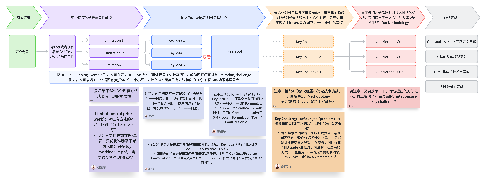

# 3.3 论文写作 - 教育技术类 Full Paper 思考模板（讨论用）

> 本文改编自 [Supervisor-Skills](https://github.com/HKUSTDial/Supervisor-Skills) (CC BY-NC-SA 4.0)，内容已针对教育技术专业博士研究场景进行迁移适配。

## 使用说明

读者可在选题讨论、进展梳理与文稿写作等阶段使用本模板中的表格，将研究思路逐项结构化填写（实例化），以利于对齐、复盘与协作交流。

**如何使用？** 可复制本模板为独立文档，在副本中逐项填写具体内容。

## 论文 Introduction 写作的思考模型（Introduction 是整个论文的精简版）

一般来说，Introduction 可以看作整篇论文的"压缩版"：用最少的篇幅把研究对象讲清楚，把问题为什么难讲透，再把我们的方法/研究设计为什么必要讲明白。一个清晰的写作组织是：先用一个典型教学场景/运行例子引出研究背景与需求；随后对现有代表性工作进行归纳，提炼其在理论假设、数据条件、应用场景约束与方法论局限下暴露的主要局限（通常不超过 3 点）；在此基础上进一步刻画该问题的本质属性与硬约束（例如样本规模、情境动态性、学习者群体的异质性、实施成本、效度与信度要求等），从而自然导出本文要解决的研究目标或问题定义（Our Goal / Problem Formulation / Research Questions），或支撑方案设计的核心洞见（Key Idea）。接着，需要明确实现该目标所面临的关键挑战（通常不超过 3 点），解释为何直接套用或简单扩展已有方法难以奏效。最后给出与挑战一一对应的方法总览（整体框架与关键模块；实证研究可压缩为"干预 + 研究设计"一句话总览），并以贡献点收束。

### Introduction 写作/构思的 Flowchart

### 快速定位：这篇论文是什么类型？

教育技术论文可以从叙事主轴出发，做如下三元分类：

**技术系统 + 实证验证型（新系统/新工具解决已知教育问题）**
- 主轴：**系统设计 + 效果证据**（学习成效证据 + 技术评估 + 可用性）
- 如：新型智能导学系统的设计与准实验效果验证；学习分析仪表盘的开发与课堂评估
- Goal：交代学习问题与系统目标即可

**理论/框架提出型（新框架、新构念、新模型）**
- 主轴：**理论建构 + 逻辑论证**（框架本身是贡献）
- 如：提出教育 AI 治理框架、教师-AI 协同教学模型、学习分析伦理框架
- Key Idea：作为"为什么这样定义合理/可行"的支撑

**实证/评估研究型（对已有干预/技术的系统评估）**
- 主轴：**研究问题（RQ）+ 实证发现**
- 如：某教育技术干预的效果评估（RCT/准实验）、学习者行为模式分析、量表开发与验证
- 主轴是 RQ 与假设，方法总览压缩为设计一句话

## 思考模板

建议结合具体研究课题，将下表逐项实例化。文末「参考资源」附有论文案例剖析说明，可供对照阅读。

<table>
  <colgroup>
    <col style="width: 20%;">
    <col style="width: 45%;">
    <col style="width: 35%;">
  </colgroup>
  <thead>
    <tr>
      <th>逻辑阶段</th>
      <th>说明</th>
      <th>内容</th>
    </tr>
  </thead>
  <tbody>
    <tr>
      <td><strong>研究背景</strong></td>
      <td>研究场景是什么？为什么重要？需要一个清晰的教学场景定义 + 研究动机</td>
      <td></td>
    </tr>
    <tr>
      <td><strong>理论基础</strong></td>
      <td>论文所依托的核心教育学/心理学/管理学理论（如认知负荷理论、自我调节学习、建构主义、最近发展区、组织学习理论等）是什么？干预/设计基于何种学习机制假设？【教育技术审稿硬指标，纯技术方案无理论支撑会被质疑】</td>
      <td></td>
    </tr>
    <tr>
      <td rowspan="4"><strong>研究问题分析与属性解读</strong></td>
      <td>对现状或者现有最新研究的分析，总结局限性。一般总结不超过 3 个现有研究或现有方案的局限性（证据缺口/设计缺口/测量缺口）。</td>
      <td></td>
    </tr>
    <tr>
      <td>Limitation 1</td>
      <td></td>
    </tr>
    <tr>
      <td>Limitation 2</td>
      <td></td>
    </tr>
    <tr>
      <td>Limitation 3</td>
      <td></td>
    </tr>
    <tr>
      <td rowspan="2"><strong>论文的 Novelty 和创新思路讨论</strong></td>
      <td>注意，创新思路不一定是和前述的局限性一一对应。即，我们有 3 个局限，也可用一个创新思路可以解决这 3 个挑战。在某些情况下，也可一一对应。</td>
      <td></td>
    </tr>
    <tr>
      <td>Key Idea（一般创新思路不会很多，常见是 1~2 个）  
      • 如果你的论文是提出<strong>新系统/新干预解决已知教育问题</strong>：主轴用 <strong>Key Idea</strong>（核心设计/机制），Goal 一句话交代或者不提也行。  
      • 如果你的论文是提出<strong>新问题/新情境/新构念</strong>（如"翻转课堂中的自我调节学习""K-12 编程教育中的计算思维测量"）：主轴用 <strong>Our Goal / Problem Formulation / RQ</strong>（把问题定义成贡献之一），Key Idea 作为"为什么这样定义合理"。</td>
      <td></td>
    </tr>
    <tr>
      <td><strong>你这个创新思路是不是很 Naive？是不是拍脑袋就能想到或者实现出来？这个时候一般要讲实现这个 Idea 或者 Goal 不是一个 trivial 的事情</strong></td>
      <td>教育技术期刊通常要求方法论部分明确研究设计与数据分析策略（而非只讲技术挑战）。如果讲挑战，一般可以从以下角度思考：  
      例：学习者行为数据的稀疏性与异构性；教育干预的因果推断困难（无法随机分组、混杂因素多）；测量工具的信效度不足；技术方案与课堂教学节奏/学校组织制度的适配困难；伦理合规（未成年人数据、知情同意）约束。</td>
      <td></td>
    </tr>
    <tr>
      <td rowspan="4"><strong>基于我们创新思路和对挑战的分析，我们提出了什么方法/方案？去解决这些挑战？ Our Methodology / 研究设计</strong></td>
      <td>总领句</td>
      <td></td>
    </tr>
    <tr>
      <td>第一个技术点/设计要素</td>
      <td></td>
    </tr>
    <tr>
      <td>第二个技术点/设计要素</td>
      <td></td>
    </tr>
    <tr>
      <td>第三个技术点/设计要素</td>
      <td></td>
    </tr>
    <tr>
      <td><strong>总结贡献点</strong></td>
      <td>常规性总结。教育技术论文的贡献类型包括：理论贡献（对现有理论的拓展、修正或情境化应用）、实证证据贡献、设计贡献（设计原则/制品）、工具/数据贡献、实践启示。至少包含一项"对教与学意味着什么"。</td>
      <td></td>
    </tr>
  </tbody>
</table>

## 参考资源

- [第六章：教育技术论文写作剖析案例](../06_Case_Studies/README.md)（原计算机科学领域的三篇案例分析——Alpha-SQL / AFlow / LEAD 与教育技术论文范式差异过大，未纳入迁移；EdTech 代表性论文剖析案例待后续补充）
