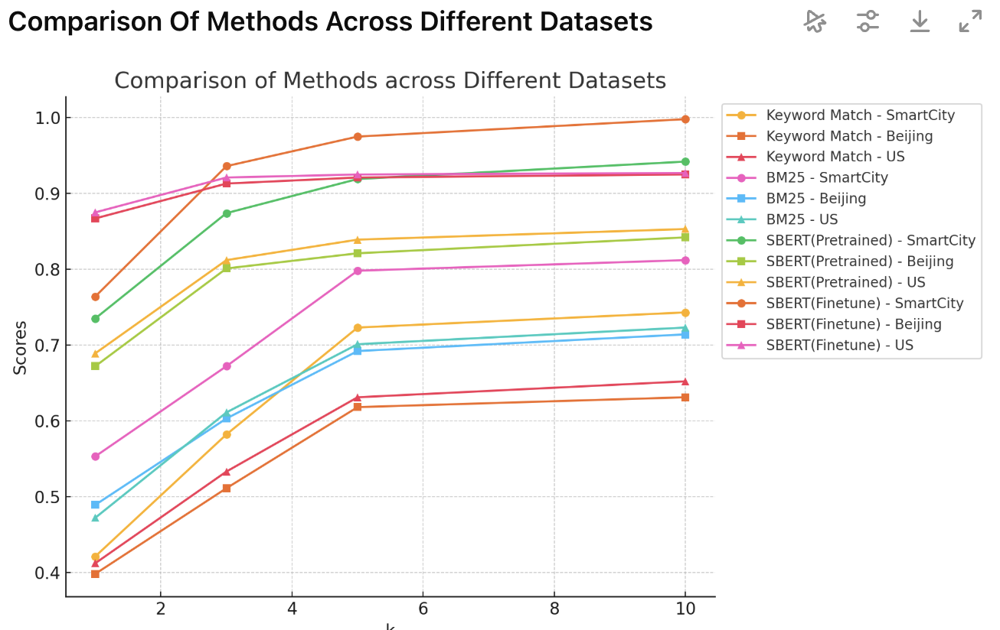
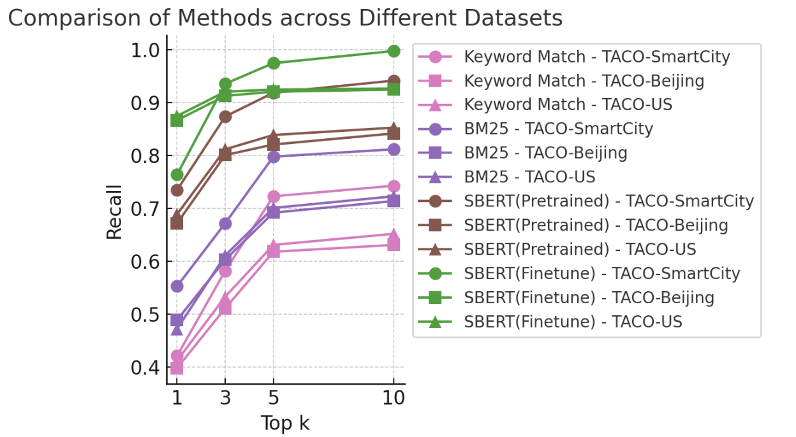

# 4.3 Experimental Results Figure（实验结果图）（教育技术版）

> 本文改编自 [Supervisor-Skills](https://github.com/HKUSTDial/Supervisor-Skills) (CC BY-NC-SA 4.0)，内容已针对教育技术专业博士研究场景进行迁移适配。

## 核心目标

Experimental Results Figure 的使命是用最直观、最具说服力的方式展示你的研究数据，支撑论文的核心结论。好的实验图能让审稿人快速验证你的干预/方法是否真的有效，差的实验图则会让审稿人质疑你的实验是否可靠。

## 常见的图表类型与适用场景

不同的研究目的需要选择不同的图表类型。以下是教育技术研究中最常用的实验图表类型及其适用场景：

| 图表类型 | 适用场景 | 设计要点 |
|---------|---------|---------|
| 分组柱状图（Grouped Bar Chart） | 干预组 vs 对照组在多维度（学业成就/学习投入/自我效能等）上的效果对比；多组条件比较 | 你的干预组用深色高亮，对照组用浅色。每组柱子之间留适当间距，在柱子顶部标注效应量或具体数值 |
| 折线图（Line Chart） | 学习者在不同时间点的知识掌握轨迹、前后测/延迟后测变化趋势、干预轮次间的效果演进 | 不同组/条件使用不同的颜色+线型+标记的组合（如实线+圆点、虚线+方块、点划线+三角形），确保黑白打印也能区分 |
| 热力图（Heatmap） | 学习者-知识点掌握矩阵、问卷维度间相关矩阵、行为模式聚类结果 | 使用连续色阶（如蓝-白-红），标注每个格子的具体数值 |
| 散点图（Scatter Plot） | 学习投入度-学业成就的关系分布、效率-效果权衡（实施成本 vs 学习收益） | X 轴为投入/成本指标，Y 轴为效果指标。你的干预/方法应该出现在右上角（高投入高产出或低投入高产出） |
| 箱线图（Box Plot） | 不同教学策略/条件下学习效果的分布与稳定性（学生间差异） | 适合展示多次运行/多班样本的结果分布。比单纯报告均值更有说服力，能同时呈现离散程度与异常值 |
| 雷达图（Radar Chart） | 多维度综合评价（知识/技能/态度/参与度/元认知）的对比 | 适合在一张图中同时对比多个条件/群体在多个维度上的表现 |

## 设计原则

### 自包含（Self-contained）

实验图必须能够独立存在。图注（Caption）、坐标轴标签（Axis Labels）、图例（Legend）必须完整。读者不看正文也能看懂这张图在对比什么、结论是什么。图注的第一句话应该概括这张图的核心发现，例如：

> "Figure 5: Learning outcome comparison between intervention and control groups. The intervention group consistently outperformed the control condition across all dimensions (d = 0.42, 95% CI [0.15, 0.69])."

### 科学严谨的视觉编码

避免"图表垃圾"（Chartjunk）。不要使用 3D 柱状图、不必要的阴影、花哨的背景或复杂的网格线。保持扁平化、简洁的设计。颜色与线型必须**双重编码**：考虑到部分读者可能有色觉障碍，或者论文被黑白打印，绝不能仅仅依靠颜色来区分不同的曲线或柱子。

### 突出你的方法/干预

如果你的干预组在多个对比中表现最好，可以使用对比度更高的颜色（如深红色或深蓝色）来高亮代表你干预组的柱子或曲线，而将其他对照组设置为灰色或较浅的颜色。

### 不要误导读者

坐标轴的起点必须合理。如果所有组的成绩都在 60-80 分之间，不要把 Y 轴从 0 开始（这样看起来差异微不足道），但也不要从 59 开始（这会夸大差异）。一个合理的做法是从 55 或 50 开始，并在图中标注。教育研究中尤其要注意：**效应量图/森林图应始终显示置信区间**，避免只画均值柱状图造成"差异显著"的错觉。

## 案例分析

**画布尺寸过大的问题**：一个常见错误是画图的 Canvas 太大，导致文本标签（Text Labels）的字体相对过小，插入排版之后看不清楚。正确做法是使用小的画图 Canvas（如长宽 150×100pt），让字体在缩放后自然变大。

| 原始图 | 优化后 |
|---|---|
|  |  |

> 建议在项目初期就建立一个统一的绘图脚本模板（如 `plot_utils.py`），定义好统一的颜色方案、字体大小、线宽等参数。这样在后续绘制多张实验图时，只需要替换数据即可保持风格一致。

## 工具推荐

也可以用 Excel 等工具把你实验结果的表格先做好，然后 Prompt LLMs 生成对应的实验插图代码。

| 首选工具 | 备选工具 | 说明 |
|---------|---------|------|
| Matplotlib + Seaborn | TikZ / PGFPlots | 必须使用代码生成，保证可重复性 |
