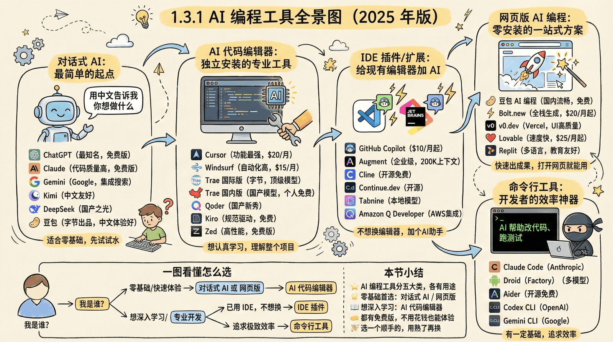
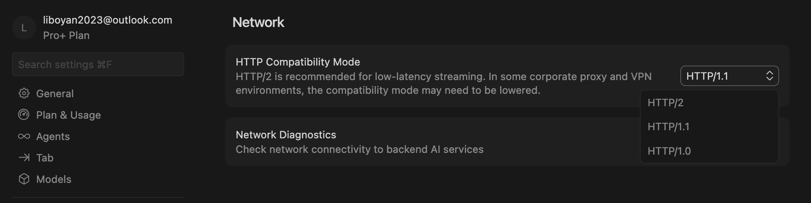
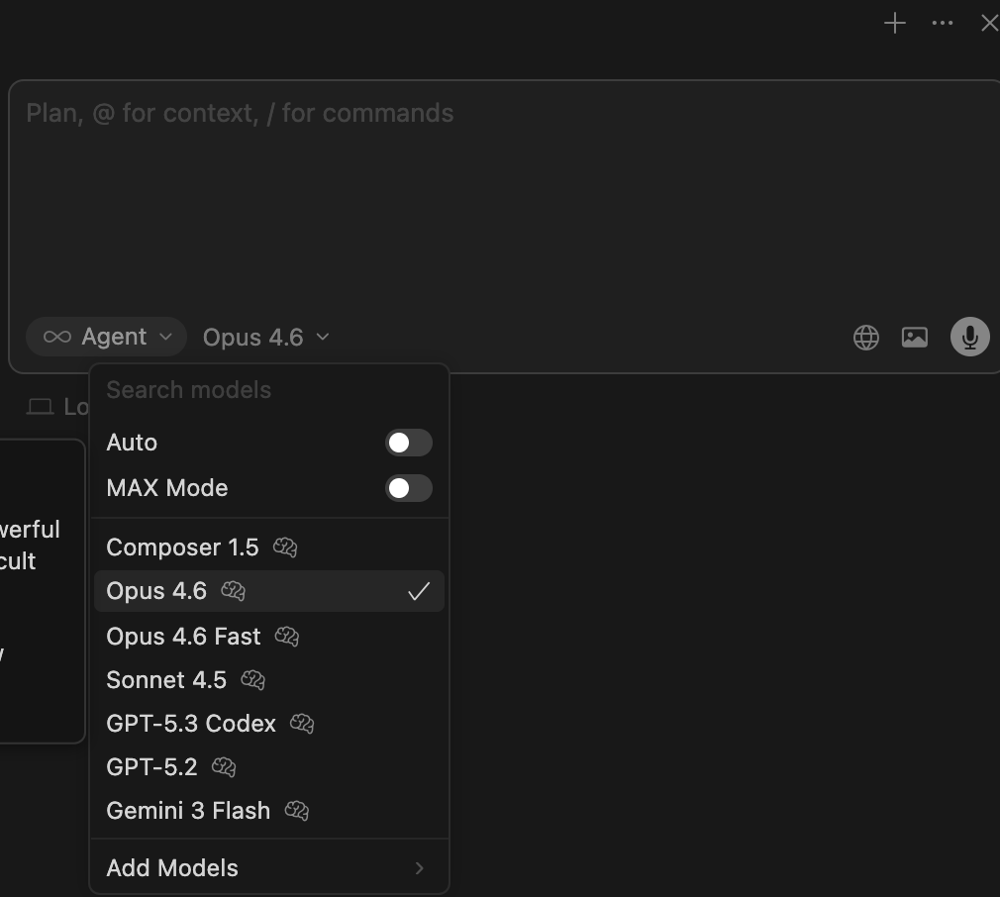
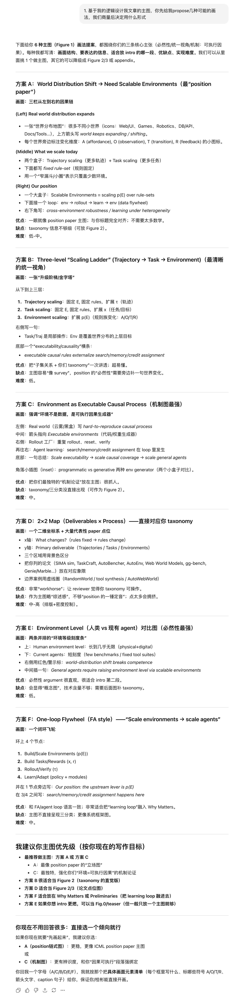
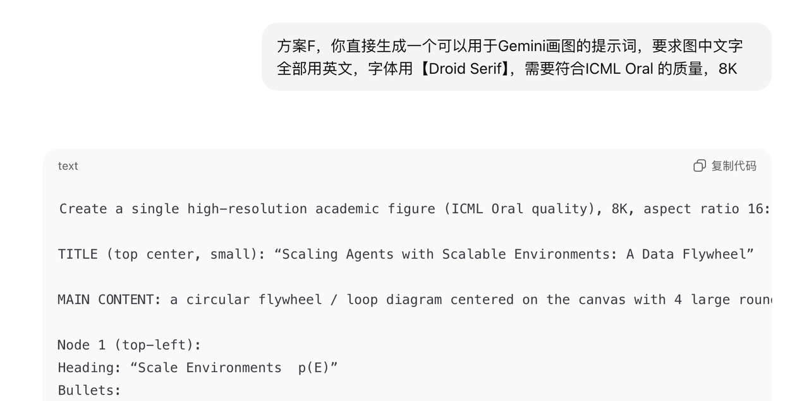
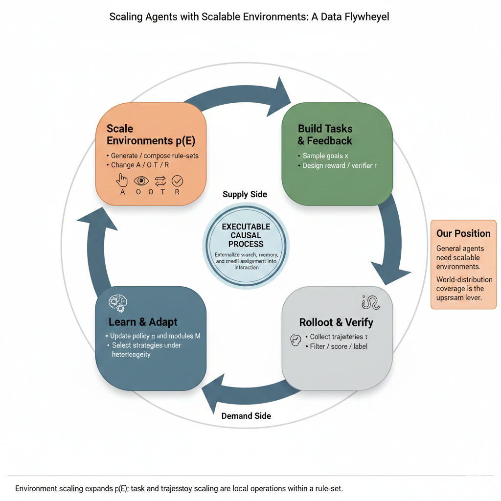
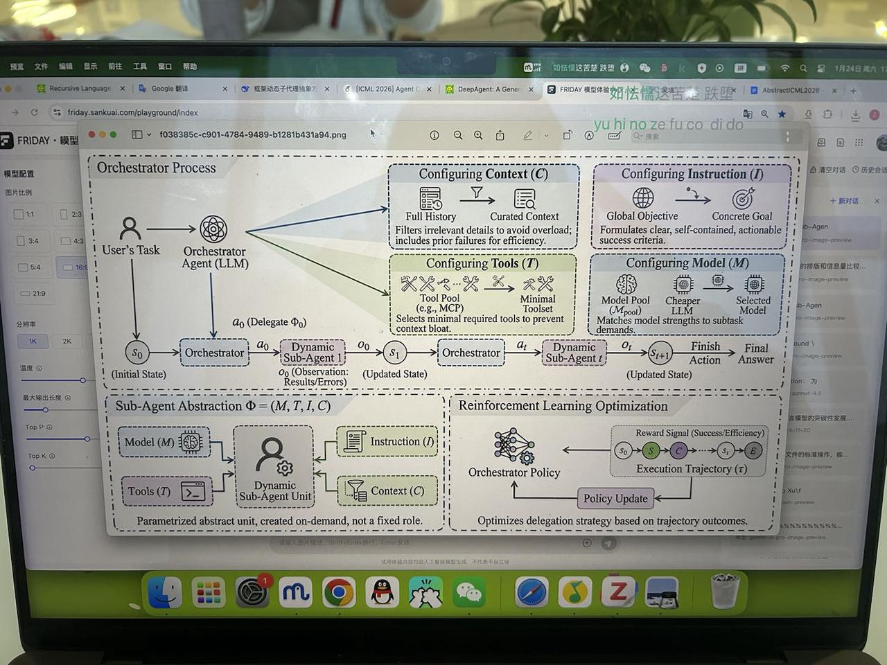
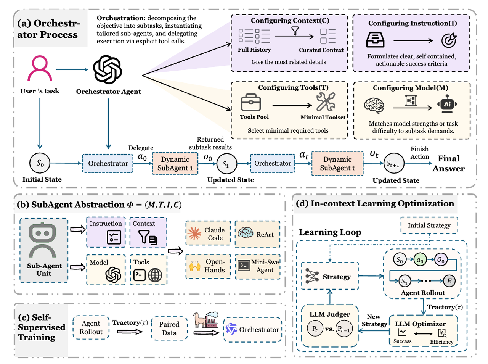
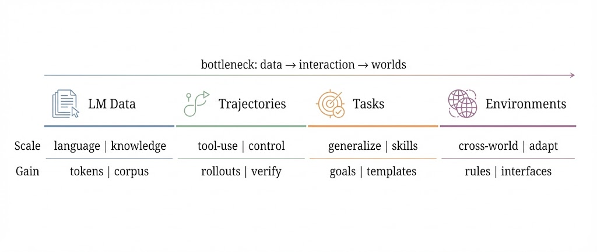

# 5.1 Vibe Research 与 Vibe Coding 入门及经验分享（教育技术版）

> 本文改编自 [Supervisor-Skills](https://github.com/HKUSTDial/Supervisor-Skills) (CC BY-NC-SA 4.0)，内容已针对教育技术专业博士研究场景进行迁移适配。
> 分享人：李伯岩（香港科技大学广州 博士二年级），导师：骆昱宇，研究方向：Text-to-SQL Agents，Data Agents

2025 年，我们见证了"Vibe Coding"从概念性的提出到引起大规模的变革，其不仅让非 AI 从业者获得前所未有的"想法即产品"能力，也让 Researchers 提高编码效率、快速实现 MVP、极大缩短论文周期。

然而随着 Agent 能力的不断拓展与提升（模态、工具、推理等），我们发现：对于 Researchers，"Vibe"将不再局限于"Coding"，而将会覆盖整个 Research Pipeline（文献、实验、论文写作、论文画图），在 2026 年我们或许会见证新的效率革命。

**Vibe Research = Vibe Coding（氛围编码）+ Vibe Figure（氛围画图）+ Vibe Writing（氛围写作）**

我们希望这份文档：
- 对于尚未接触"Vibe"的同学，可以快速入门 Vibe 工具的使用，体验到效率的革命
- 对于已经在"Vibe"的同学，可以 Get 到一些实用技巧和经验，进一步提升效率和质量

> 注：本文方法论的演示案例多出自计算机科学领域（Text-to-SQL、Agent 系统等），但其心法与技法对所有研究领域（包括教育技术）完全适用。教育技术研究者可将其用于学习分析原型搭建、问卷/实验数据处理、量表开发、论文绘图与写作全流程。

---

## 行为准则

1. 我们允许并鼓励合理使用 AI 或 LLM 作为辅助工具，包括但不限于：
   a. 文献检索与整理；
   b. 代码辅助、调试建议；
   c. 语言润色与表达改进。
2. 学术思想、研究问题、研究设计、技术路线、实验方案、核心结论与创新点必须由学生/导师完成并完全理解。AI / LLM 仅可提供辅助支持，不得将研究主导权或关键学术判断交由 AI 工具生成。
3. 所有由 AI / LLM 生成或辅助生成的内容，学生必须逐条核查其准确性，并确保其与实际研究过程、实验结果和事实完全一致。不得因使用 AI 工具而引入错误、夸大、不一致或无法复现的描述。
4. 不得使用 AI / LLM 生成、编造或猜测学术文献、参考文献条目或引用信息。所有引用文献必须来源真实、可核查，并由学生本人完成检索、阅读与确认。
5. 不得使用 AI / LLM 进行任何形式的学术不端行为，包括但不限于：
   a. 生成虚假数据、实验结果或引用；
   b. 伪造、篡改或编造实验过程；
   c. 掩盖对他人工作的抄袭或不当改写。
6. 在学术论文投稿、学位论文撰写或其他正式学术成果中，如期刊、会议或学校对 AI 使用有明确披露或限制要求，应严格遵守相关规定；如存在不确定性，应提前与导师沟通。

---

## 背景

### 一条推文引发的革命

2025 年 2 月，前特斯拉 AI 总监、OpenAI 联合创始人 Andrej Karpathy 在社交媒体上发了一条推文：

> 有一种新的编程方式，我称之为 "vibe coding"（氛围编程）。你完全沉浸在感觉中，拥抱指数级变化，甚至忘记代码的存在。

这条推文引发广泛讨论的原因是——我们正在进入一个不需要"写"代码也能"做"软件的时代。

### "Vibe Coding" 成为年度热词

2025 年 11 月，柯林斯词典宣布："Vibe Coding" 当选年度词汇。

这个词的官方定义是：

> 一种使用人工智能、通过自然语言描述来生成计算机代码的方式。

换句话说，你不需要学什么编程语言，只要用自然语言告诉 AI"我想要一个 XX"，它就能帮你做出来。

### 数据不会说谎

**Y Combinator 的惊人发现**

2025 年 3 月，全球最著名的创业孵化器 Y Combinator 的 CEO Garry Tan 透露：在最新一批创业公司中，有 25% 的公司报告——它们 95% 的代码是由 AI 生成的。

这些不是玩票的业余项目，而是正在融资、正在增长的真实创业公司。更让人惊讶的是，**这些公司的团队规模往往不到 10 人**，做出以前需要几十人才能完成的产品。

**对教育研究者的启示**：同样的效率革命正在进入学术研究。教育技术研究者可以借助 AI 快速完成学习分析原型系统、问卷数据处理脚本、量表分析、文献综述的初筛与整理，从而把时间投入到真正需要学术判断的地方——研究问题、理论框架与证据解释。

---

## Vibe Coding（氛围编程）

> Vibe Coding 的核心转变：从"写代码"变成"表达清楚 + 判断对错"

### 当我们从 Coder 到 Commander

**什么变了？**

| 过去 | 现在 |
|------|------|
| 记住语法规则 | 把需求描述清楚 |
| 手写代码 | 判断代码对不对 |
| 调试找 Bug | 描述问题让 AI 修 |
| 阅读技术文档 | 知道什么该问、什么该查 |

**什么没变？**
- 你需要知道自己想要什么：AI 再聪明，也不能替你想清楚要做什么
- 你需要判断结果好不好：AI 可能会出错，你得能看出来
- 你需要有解决问题的思路：遇到问题时，知道怎么一步步排查

### 工欲善其事，必先利其"器"

2025 年的 AI 编程工具，就像点外卖 App 一样多，对于 Researchers 而言，我们推荐使用最前沿的"模型"+最好用的"工具"。



### 工具（IDE/CLI）选择

- **Cursor**：基于 VS Code 的 AI 原生代码编辑器（IDE），支持 MacOS 以及 Windows 系统，与 VS Code 深度集成，入门成本低。（收费最低 20$/月）
- **Codex**：OpenAI 发布的 Agent 编码助手，有 CLI 和 Desktop 应用，无 Code Editor，与 GitHub 集成较好，支持云端环境开发。（收费最低 20$/月）
- **Claude Code**：Anthropic 公布的氛围编程工具，目前有 CLI 和 Desktop 应用，无 Code Editor，入门成本相比 Cursor 偏高，熟练进阶后玩法更多（丰富的 Skills、MCP）

### Cursor 安装与使用

- 下载安装，注册登陆：https://cursor.com/cn/docs/get-started/quickstart
- 如何在 Cursor 中使用国外模型（Codex-5.3、Gemini3-Pro、Claude Opus 4.6 等）？
  - 购买 Pro 会员（最低 Plan 为 20$/月，适合日常辅助；高强度使用可能不够）
  - 代理（注意确保 OpenAI、Google 等请求被正确转发）
- **(Important)** 设置 HTTP Compatibility Mode 为"HTTP/1.1"（然后重启 Cursor）

| HTTP Compatibility Mode 设置示意 | Cursor 界面示意 |
| --- | --- |
|  |  |

### 根据需求丰富插件生态

- 团队协作、版本控制 → GitLens（版本控制追踪）、GitGraph（分支图形化）等
- 第三方 AI 工具、丰富 AI 编码生态 → GitHub Copilot、Claude Code for VS Code 等
- 容器开发/远程开发 → Remote - SSH、Dev Containers、Docker 等

### 教育研究场景的数据分析辅助工具

除了编程 IDE，教育技术研究者日常高频使用的统计/质性分析工具，也普遍接入了 AI 辅助能力：

| 工具 | 用途 | AI 辅助方式 |
|---|---|---|
| SPSS / R (RStudio) / Stata | 问卷与实验数据统计分析（描述统计、t 检验、ANOVA、回归、多层模型） | 用自然语言让 AI 生成 R/Python 分析脚本与解释输出；让 AI 协助做功效分析（G*Power 之外的第二意见） |
| NVivo / MAXQDA | 质性数据分析（访谈转录编码、主题分析） | 让 AI 协助整理编码框架初稿、批量摘要访谈文本（编码判断必须人工把关） |
| 问卷平台（问卷星/Qualtrics）+ AI | 量表条目草拟、反向题检查 | 让 AI 起草条目并做表述检查，但构念操作化与效度论证必须由研究者完成 |

> 铁律不变：统计检验与质性编码是研究者的学术责任。AI 生成的任何脚本、编码建议都必须人工验证——"判断对错"永远是人的工作。

---

## 方法论（心法、技法）

> 我们从"心法"和"技法"两个互补的角度，帮助大家掌握 Vibe Coding 的方法论，用更高的效率，写出更高质量的代码。

### 心法（应该牢记的原则）

- **凡是 AI 能做的，就不要人工做**
- **一切问题问 AI**
- **目的主导**：开发过程中的一切动作围绕"目的"展开
- **上下文是 Vibe Coding 的第一性要素（上下文为王）**："Garbage in, Garbage out"
- **奥卡姆剃刀定理**：如无必要，勿写无关代码，减少无关 context 的干扰
- **减法思维（MVP 开发）**：用最小的投入（Minimum），验证核心假设（Visible），交付最小的价值（Product）

### 技法（可以利用的技巧）

**1. 先规划后执行**

对于 Cursor 来讲，在实现一个最小 MVP 时，使用 Plan Mode（Shift+Tab 切换），让 AI 先生成计划，无误后再切换到 Agent Mode。
- 确保 AI 能够理解你要实现的想法（Idea）、实现（Implementation）、实现目标（Goal）
- 提前发现 AI 的理解偏差，及时纠正

**2. 明确的问题需求**

> **明确的需求 = 更少的返工 + 更少的错误**

- 你想实现什么？
- 功能是什么？
- I/O 输入输出是什么？
- 特殊的代码规范、额外的要求、约束条件？比如不要使用 LangChain 构建，而使用原生的 OpenAI 包调用 LLM；需要在可能的情况下进行并行优化等。

> **不要让 AI 猜你想要什么，而是告诉 AI 你要做什么，应该怎么做**

```
我想实现一个功能模块[Module Name]，这个模块的作用是[Function Description]，
它的输入是[Input]，输出是[Output]。

注意：
- 模块的输入是一个CSV文件，每一行为一位学生的[学习行为/问卷作答]记录，结构为{"key": value, ...}
- 模块的输出是一个CSV文件，并且我可以配置输出文件的保存路径
- 模块需要有详细的Logging，你可以使用Loguru Python Package
- 使用多线程并行/多进程并行优化执行效率，并且我可以配置并行度
```

**3. Cost（小步快跑）<<< Cost（大步迈进）**

<ol type="a">
  <li>每次让 AI 实现一个最小功能单元（Minimum Functional Unit）</li>
  <li>实现完成后，立即进行 Code Review / Testing</li>
  <li><strong>‼人工监督仍然重要‼</strong>
    <ol type="i">
      <li>避免代码成为 shi 山的最后护城河！</li>
      <li>你可以不仔细看每一行代码，但你需要确保整个逻辑是你想要的（符合预期）</li>
      <li>防止堆积大量未经审核、偏离预期的代码</li>
    </ol>
  </li>
  <li>牢记一点点的小步稳重实现，永远优于一次性的大步迈进</li>
</ol>

**4. 管理上下文（上下文为王）**

<ol type="a">
  <li>模型在单个 Chat Session 中容易触发 Context Limit（到达最大上下文）
    <ol type="i">
      <li>Cursor 或 Claude Code 等工具会进行 Context Summarization（上下文总结）</li>
      <li><strong>然而这不意味着信息能够无损保留！</strong></li>
      <li>因此，复杂任务可以拆分多个 Chat Session（会话）</li>
    </ol>
  </li>
  <li>当发现 AI "忘记"了你之前要求的"规范"、产生了幻觉等时：
    <ol type="i">
      <li>立刻补充当前需求相关的上下文信息（参照第 2 点"明确的问题需求"）</li>
      <li>建议新开一个 Chat Session，保持模型对当前需求的 Attention</li>
    </ol>
  </li>
</ol>

**5. 错误纠正要提供足够详细的错误信息**

当 AI 的代码运行出错时，要提供足够的错误上下文：

- 错误代码文件是哪个？
- 运行命令是什么？
- 出现了什么错误？（Terminal 中的 Error Stack Traceback）

示范：

```text
错误问法：
我的代码运行报错了，帮我修一下。

正确问法：
我的 Python 脚本在处理问卷数据时崩溃了。请根据以下的上下文和错误堆栈帮我修复。

1. 出错的代码文件 (survey_analysis.py)
2. 运行命令：`python survey_analysis.py`
3. 终端报错信息 (Error Stack Traceback)：
Traceback (most recent call last):
File "survey_analysis.py", line 8, in <module>
score = item['score'] / item['max_score']
TypeError: can't multiply sequence by non-int of type 'float'
```

**6. （进阶）版本控制**

a. 练习/熟练使用 Git Add/Commit/Push 命令
```bash
git add <files>
git commit -m "详尽的Comments"
```

b. 每完成一个最小功能单元，让 AI 进行 Git Commit 并附带详尽的 Comments，比如：
```
feat: add learning behavior feature extraction module
- Add clickstream aggregation and help-seeking pattern features
- Extract SRL indicators from LMS logs
- Add unit tests for feature pipeline

Co-authored-by: Cursor <cursoragent@cursor.com>
```

c. 用好版本控制将让整个项目开发周期受益
- AI 破坏了原本正确的代码 → 版本回滚
- 多分支开发 → 团队协作，减少冲突

---

## Vibe Figure（氛围画图）

> 对于一篇论文（Research Project）来讲，Vibe Coding 的结束代表"Experiments"的完成。

接下来我们要进入 Paper 的撰写，首要的便是 Figures，如 Teaser Figure、Overview Figure、Motivation Figure 等。教育技术论文同样如此（动机图、研究框架图、学习分析 Pipeline 图、效应量对比图等）。

### 第一步：绘图设计

这一步的核心逻辑，是把"论文逻辑"讲清楚，然后和 LLM 讨论画图的细节/你的预期。

- 基于我的逻辑设计我文章的主图，你先给我 propose 几种可能的画法，我们商量后决定用什么形式
- 基于这个形式，生成可以被直接用于 Gemini 生图的 Prompt，要求图中文字全部用英文、字体用[指定]、需要符合[投的期刊/会议]的质量，8K

Prompt 讨论与生成示例：





### 第二步：草图生成

使用强大的文生图模型生成草图，推荐 Gemini 网页端 / Nano Banana Pro。输入第一步得到的绘图提示词，快速迭代设计方案。



### 第三步：重绘矢量图

Gemini / Nano Banana Pro 模型生成的草图是标量图（PNG），不能直接放入 Paper。

- 可以尝试最近很火开源项目，[**Edit Banana**](https://www.editbanana.net)这个工具将大模型生成的不可编辑的图，转化成可编辑矢量图。开源仓库：https://github.com/BIT-DataLab/Edit-Banana。

精通手绘的同学，也可以使用一些画图工具，对照草图，手动绘制矢量图（PDF / SVG）。

- 网页端 Figma：https://www.figma.com
- MacOS OmniGraffle
- PowerPoint（PPT）

绘图工具没有高低之分，自己熟练的最好。

### 一些 Icon 来源

- https://www.iconfont.cn
- https://www.flaticon.com
- GPT 生成：https://chatgpt.com/share/697a18b4-c2dc-8008-8239-b1b91b948fc4

### 示例展示

> 以下示例出自计算机科学论文（Aorchestra、Position: Scalable Environments...），演示的是"如何用 Vibe Figure 流程为论文设计配图"的完整工作流——教育技术论文（如学习分析仪表盘主图、自适应学习系统框架图、干预效果对比图）的配图流程完全同理。

| Aorchestra 示例 1 | Aorchestra 示例 2 |
| --- | --- |
|  |  |

### Figure Prompt 与生成结果（示例）

下面以一篇论文的时间轴式首图为例，展示"设计 → Prompt → 生成"的完整过程。教育技术研究者可类比写出自己论文配图的 Prompt（把图中的阶段、组件替换为你的研究框架要素）。

#### 时间轴式首图方案



**对应 Prompt（节选，展示关键规格要求）**

```text
图片里不要出现中文，字体使用Droid Serif

你是一位为学术会议 Position Paper 设计学术首图的图形设计师。请生成一张"极简、干净、
可发表"的双栏通栏（full-width）首图，用来表达：Scaling 的目标从 LM→Agent→General
Agent 逐步演进，最终指向 Environment / World Distribution Scaling。

【硬性输出规格】
- 分辨率：8K 超高清（至少 7680px 宽；建议 7680×3200 或相近宽高比）
- 版式：适配双栏论文的通栏大图（宽:高 ≈ 2.2:1 ~ 2.6:1）
- 风格：极简扁平、矢量感、白底、无渐变、无 3D、线条清晰、留白充足
- 字体：现代无衬线（统一字号层级，缩小后仍可读）
- 配色：4 个柔和、专业、低饱和的强调色（每个阶段一种）；同时保证黑白打印可读（对比足够）
- 不要出现任何长句、口号、观点气泡、解释性段落；只保留必要标签

【整体构图】
一条从左到右的"时间轴/演进轴"（x 轴），分成 4 个连续阶段（像分段色带/分段条形）。
图中只表达两件事：1) 我们在 scale 什么（下层）；2) 带来什么能力收益（上层）。
此外加一个非常简洁的"瓶颈迁移"细箭头（无长句，仅短标签）。

【布局结构（极简）】
- 主体：4 段连续的横向分段条（同高度、或最后一段略强调但不夸张）
- 每一段包含：A) 阶段短标题（仅 1 行） B) 一个小线稿图标 C) 下方 2 个关键词 D) 上方 2 个关键词
- 段与段之间用细分隔线区分；顶部允许一个极短的总标题
- 不要任何额外说明框、气泡、立场句、段落解释

【设计细节】
- 全图文字必须极少：每段最多 1 个短标题 + 上下各 2 个关键词
- 保证缩小到论文中仍清晰可读；图标线条统一粗细；不要复杂细节
- 不要引用、不要论文名、不要机构 logo、不要网址
- 整体高级、干净、像顶会论文 teaser

请直接输出最终成品图像（8K），不要解释过程。
```

#### 四区闭环图方案


**对应 Prompt（关键规格）**：风格与上述一致（极简、扁平、8K、统一线宽、最小字号 8pt、低饱和配色、图例精简）。布局为"四区 + 图例"：A 区三条泳道（分类学）→ B 区三个产出物 → C 区能力阶梯 → D 区底部闭环（Generate → Interact → Learn → Expand），角落放极简图例。每区只写短标签（5-8 词以内），不写段落。

> 教育技术论文的配图 Prompt 可把上述结构映射为：A 区 = 学习者数据维度（行为/情感/社交）、B 区 = 建模产出（学习者画像/诊断报告/推荐序列）、C 区 = 能力收益（掌握度/投入度/自我调节）、D 区 = 数据闭环（采集→建模→干预→再采集）。

---

## Vibe Writing（氛围写作）

### 写作准则

- **不允许直接 Copy AI / LLM 生成 Paper 内容**，学生必须逐条核查其准确性，并确保其与实际研究过程、实验结果和事实完全一致
- **不允许让 AI / LLM 撰写论文参考文献，猜测参考文献，自由引用参考文献等**
- AI / LLM 仅可提供辅助支持，不得将研究主导权或关键学术判断交由 AI 工具生成

### 技巧

- **上下文为王，提供全面、详尽的上下文**
  - 研究问题、研究背景、现有工作、现有局限、核心挑战、提出的方法/研究设计
  - 实验数据表格（LaTeX 格式；教育研究还包括效应量与置信区间、问卷信效度指标）
  - 论文图例（使用多模态模型如 Gemini/GPT 等进行上传）
- **LLM 仅限于辅助写作思路，学生应当自行理解、校验并撰写 Paper 内容**

> 教育技术论文写作中尤其注意：让 AI 辅助讨论"理论对话"（你的发现与某学习理论/已有研究的关系）时，必须提供该理论/文献的原文与页码，AI 生成的理论断言一律人工核实后再使用。
